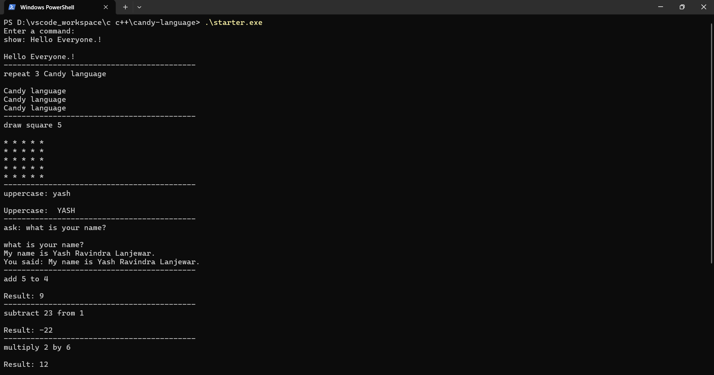
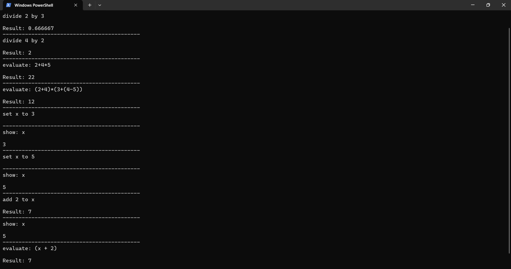

Here's a detailed README documentation for your Candy language repository. This documentation provides an overview of Candy, installation instructions, usage examples, and command explanations, suitable for a GitHub repository.

---

# Candy Language Interpreter

Candy is an easy-to-use, child-friendly programming language designed to help beginners, especially children, get familiar with programming concepts. With simple syntax and intuitive commands, Candy aims to make coding accessible and fun!

## Features

- **Variables**: Store and retrieve values for reuse.
- **Math Operations**: Perform basic math operations such as addition, subtraction, multiplication, and division.
- **Looping**: Repeat actions a specified number of times.
- **Shapes**: Draw basic shapes like squares with customizable dimensions.
- **Text Manipulation**: Convert text to uppercase and handle basic text output.
- **Simple Evaluations**: Evaluate arithmetic expressions.
- **Interactivity**: Ask questions and capture user input.

## Installation
<ol>
<li>Download starter.exe file.</li>
<li>Brower through the folder where the starter.exe is present</li>
<li>run the command ".\starter.exe"</li>
</ol>
## Usage

Once the Candy interpreter is running, you can type commands directly into the terminal. Here are the supported commands:

### Commands Overview




- **Setting Variables**: Define a variable with `set` and retrieve it with `show`.
  ```plaintext
  set name to Hello, Candy!
  show: name       // Output: Hello, Candy!
  ```

- **Basic Math Operations**: Perform operations with `add`, `subtract`, `multiply`, and `divide`.
  ```plaintext
  add 5 to 3       // Output: Result: 8
  subtract 2 from 8 // Output: Result: 6
  ```

- **Repeat Command**: Repeats a message a specified number of times.
  ```plaintext
  repeat 3 Hello!  // Output: Hello! (three times)
  ```

- **Drawing Shapes**: Draw squares with the `draw square` command.
  ```plaintext
  draw square 4
  ```

- **Uppercase Conversion**: Convert text to uppercase.
  ```plaintext
  uppercase: hello world // Output: HELLO WORLD
  ```

- **Ask and Capture Input**: Interact with the user using the `ask` command.
  ```plaintext
  ask: How are you?     // User types response
  ```

- **Expression Evaluation**: Evaluate arithmetic expressions.
  ```plaintext
  evaluate: (5 + 2) * 3 // Output: Result: 21
  ```
- **To Exit**: simply write bye or ctrl + c.
  ```plaintext
  bye // exit from the code
  ```

### Example Session

```plaintext
set x to 5
set y to 10
add x to y              // Output: Result: 15
show: x                 // Output: 5
draw square 3           // Outputs a 3x3 square of *
repeat 2 Hello, World!  // Output: Hello, World! Hello, World!
ask: What's your name?  // Output: (prompts user input)
```

### Code Documentation

#### Core Functions

- **setVariable**: Assigns a value to a named variable.
- **getVariable**: Retrieves the value of a variable.
- **getValue**: Checks if a string is a variable and retrieves its value; otherwise, treats it as a number.
- **calculate**: Parses and evaluates mathematical expressions, supporting `+`, `-`, `*`, `/`, and parentheses.
- **show**: Outputs text or variable values.
- **repeat**: Repeats a message a specified number of times.
- **add, subtract, multiply, divide**: Basic arithmetic functions.
- **drawSquare**: Draws a square with a specified side length.
- **uppercase**: Converts a string to uppercase.
- **ask**: Prompts the user with a question and captures their response.

#### Error Handling

Candy includes error handling for:
- **Division by zero**: Throws an error if a division by zero is attempted.
- **Undefined variables**: Throws an error if a variable is used before being defined.

## Contributions

Contributions to Candy are welcome! For major changes, please open an issue to discuss your ideas.

---

This documentation should serve as a helpful guide for users to get started with Candy and understand its features. Let me know if you'd like more details on any section!
